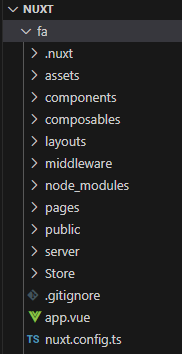

# Nuxt Project Structure 📁

 

This README explains the primary folders and files in a Nuxt project, helping you understand their purposes and how to use them effectively.

## Key Directories

1. **`.nuxt/`** ⚙️
   - Dynamically generated directory for build and runtime setup.
   - Contains compiled routes, component references, and generated files.
   - Re-created with each `npm run dev` or `npm run build`.

2. **`assets/`** 🎨
   - Holds uncompiled assets like images, fonts, and CSS files.
   - Ideal for files processed by the bundler, such as SCSS files or unoptimized images.

3. **`components/`** 🧩
   - Stores reusable components, such as buttons, modals, or cards.
   - Auto-imported in Nuxt 3, simplifying their usage across pages and layouts.

4. **`composables/`** 🔄
   - Stores composable functions to encapsulate logic that can be reused across components.
   - Useful for complex logic, data fetching, and state management that needs to be shared.

5. **`layouts/`** 🖼️
   - Defines page layouts, such as headers, footers, and sidebars.
   - `default.vue` serves as the primary layout, but additional layouts can be created for different sections of the app.

6. **`middleware/`** 🔒
   - Contains custom middleware for controlling route access and navigation logic.
   - Middleware files here can be global or route-specific, useful for tasks like authentication checks.

7. **`node_modules/`** 📦
   - Directory containing all the dependencies installed via `npm` or `yarn`.
   - Managed by Nuxt and not edited directly.

8. **`pages/`** 📄
   - Manages **file-based routing** in Nuxt.
   - Each `.vue` file in `pages/` automatically becomes a route. For example, `pages/index.vue` maps to `/`.

9. **`public/`** 🌐
   - Contains static assets accessible directly at the root URL, such as `favicon.ico`.
   - Files here are not processed by Webpack, making it ideal for static files.

10. **`server/`** 🌐
    - Used for backend logic when building a full-stack app.
    - Contains API routes or server-side functions that Nuxt can access directly.

11. **`store/`** 🗄️
    - The main directory for state management files, such as Pinia stores.
    - Centralizes app state, making it accessible across components and pages.

## Important Files

- **`app.vue`** 🏠
  - The root component of the application. Wraps the `<NuxtPage />` component, providing a global layout.

- **`nuxt.config.ts`** ⚙️
  - The main configuration file for Nuxt, where global settings, plugins, modules, and environment variables are defined.

- **`package.json`** 📄
  - Lists the dependencies and scripts for the project, such as `dev` and `build`.
  
- **`tailwind.config.js`** 🎨
  - Configuration file for Tailwind CSS, defining custom styles, themes, and responsive settings if Tailwind is used.

This structure provides modularity and a clear organization, ensuring smooth development and scalability of your Nuxt application.