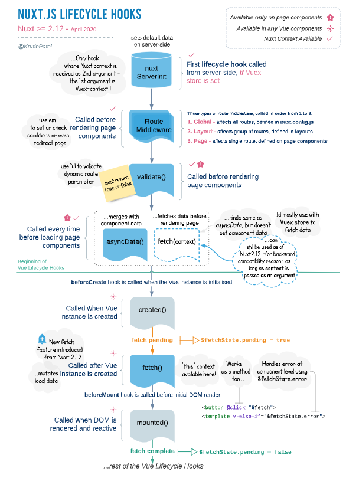

# Vue and Nuxt.js Lifecycles: When and How to Use Them

### 🛠️ The Issue with Lifecycle Mismatch
One common mistake developers make when working with Vue or Nuxt.js is encountering errors like `Cannot read properties of undefined`. This happens when a component tries to access data that hasn’t been fetched or initialized yet.

This issue often arises from a misunderstanding of how Vue and Nuxt.js lifecycle hooks work. The timing of data-fetching logic matters, especially in scenarios involving API calls or server-side rendering (SSR).

For example, consider a login-based application:
- A user logs in by entering their details, which are verified via a backend call.
- Upon successful login, the user is redirected to a home page where their name and other details need to be displayed.
- If the user reloads the home page, an error like `Cannot read properties of undefined` might appear.

**Why?**
If the user’s details are fetched asynchronously (e.g., through Sanctum in Nuxt.js) and accessed in the `created()` hook, the rendering occurs **before the fetch completes**, causing undefined errors.

**Solution:**
Place the data-fetching logic in the `mounted()` hook instead of `created()`. The `mounted()` hook runs **after** data fetching and ensures that the data is available when the component is rendered.

---

### 🤔 Understanding Lifecycle Hooks
Lifecycle hooks control the flow of a component from initialization to destruction. Let’s break down the key lifecycle hooks relevant to this problem:

#### **1. `created()` Hook**
- 🕒 **Timing:** Runs after the component instance is created but before the DOM is mounted.
- 🔗 **Reactive Data:** Component data is initialized and accessible.
- ❌ **DOM Access:** The DOM is not available yet.
- **Use Case:** Logic that doesn’t depend on DOM elements or server-rendered data, such as initializing variables.

#### **2. `fetch()` Hook** (Specific to Nuxt.js)
- 🕒 **Timing:** Executes before the component is rendered (on both client and server).
- 🔗 **Purpose:** Allows asynchronous data fetching to be completed before rendering.
- ✅ **SSR Compatibility:** Ensures data is ready for server-side rendering.
- **Use Case:** Pre-fetching data for SEO or server-side rendered pages.

#### **3. `mounted()` Hook**
- 🕒 **Timing:** Runs after the DOM has been rendered and is fully reactive.
- 🔗 **Purpose:** All DOM elements are accessible, and you can interact with them.
- **Use Case:** DOM-dependent logic, initializing visual libraries, or client-only API calls.

---

### 📋 Why These Hooks Matter
Using the wrong hook for data fetching can lead to undefined errors or timing issues:
- **Using `created()` for data fetching:** The component initializes, but the DOM or server-side data might not be ready, leading to errors during rendering.
- **Using `fetch()` in Nuxt.js:** Ensures that data is available before rendering, making it ideal for SSR scenarios.
- **Using `mounted()` for client-side data fetching:** Avoids timing issues since the DOM is already rendered.

---

### 🔄 Lifecycle Hooks: When to Use Each
| Hook       | Timing                           | Best For                                                                 |
|------------|----------------------------------|-------------------------------------------------------------------------|
| `created()`| After instance initialization    | Setting up logic, initializing variables, no DOM or SSR-specific logic. |
| `fetch()`  | Before rendering (Nuxt.js only)  | Asynchronous data-fetching for SSR or pre-rendering.                   |
| `mounted()`| After DOM is rendered            | DOM-related logic, client-side API calls.                              |

---

### 🔍 Nuxt.js Lifecycle Diagram
Below is a visual explanation of Nuxt.js lifecycle hooks. You can use this to better understand when specific hooks execute.

---

### 📝 Key Takeaways for Lifecycle Usage
1. **Use `fetch()` for SSR or when you want the component to have data before rendering.**
   - Example: SEO-optimized pages where server-side rendering is crucial.
2. **Use `mounted()` for client-side logic that requires DOM interaction.**
   - Example: Adding event listeners or initializing UI libraries.
3. **Avoid relying on `created()` for asynchronous logic or DOM-related operations.**

By aligning your logic with the correct lifecycle hook, you can avoid common pitfalls and ensure your applications are both performant and error-free.

---